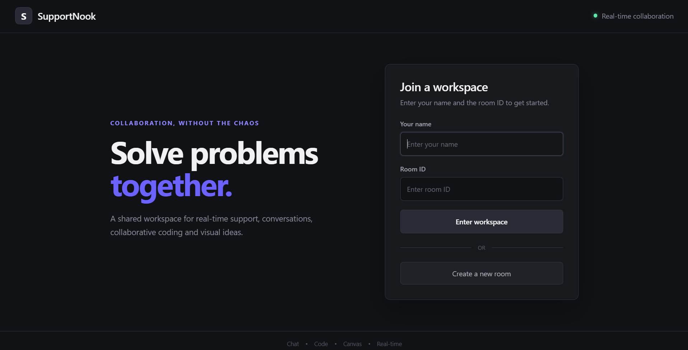
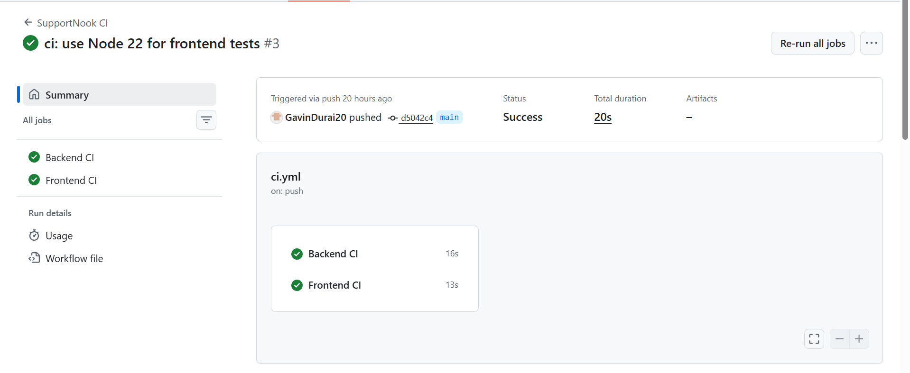
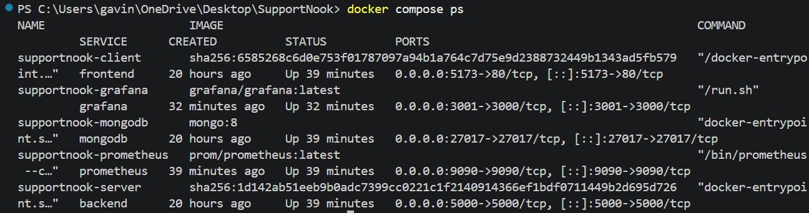
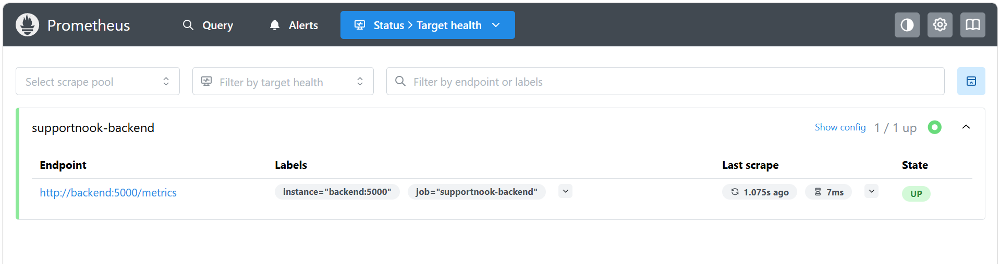
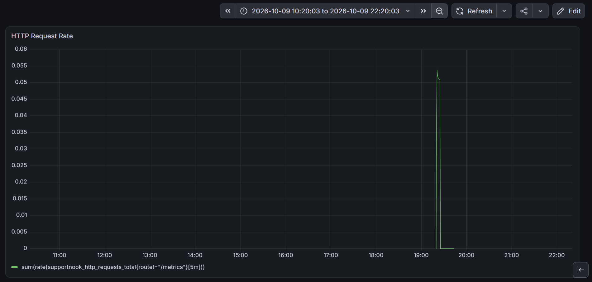

# SupportNook

SupportNook is a real-time collaborative support workspace that enables multiple users to work together in shared rooms for communication, collaborative coding, code execution, and visual collaboration.

The project is built with React, Node.js, Express, Socket.IO, MongoDB, Docker, GitHub Actions, GitHub Container Registry, Prometheus, and Grafana.

---

## 1. Key Features

- Real-time collaborative chat
- Room-based collaboration
- Collaborative code editor
- Multi-language code execution using Judge0
- Real-time collaborative whiteboard
- REST API built with Express.js
- WebSocket communication using Socket.IO
- MongoDB persistence
- Automated frontend and backend testing
- Dockerized local development environment
- GitHub Actions CI/CD pipeline
- Docker image publishing to GitHub Container Registry
- Prometheus metrics collection
- Grafana monitoring dashboard

---

## 2. Technology Stack

| Category | Technologies |
|---|---|
| Frontend | React, Vite |
| Backend | Node.js, Express.js |
| Real-time Communication | Socket.IO |
| Database | MongoDB |
| Code Execution | Judge0 |
| Testing | Vitest, React Testing Library, Supertest |
| Containerization | Docker, Docker Compose |
| CI/CD | GitHub Actions |
| Container Registry | GitHub Container Registry (GHCR) |
| Monitoring | Prometheus, Grafana |
| Frontend Deployment | Vercel |
| Backend Deployment | Render |

---

## 3. System Architecture

```text
                              SupportNook
                                   |
                  +----------------+----------------+
                  |                                 |
                  v                                 v
          +---------------+                 +---------------+
          |   Frontend    |                 |    Backend    |
          | React + Vite  |<----Socket---->| Node + Express|
          |               |                 |   Socket.IO   |
          +---------------+                 +-------+-------+
                                                   |
                                  +----------------+----------------+
                                  |                |                |
                                  v                v                v
                              MongoDB           Judge0          Prometheus
                                                                    |
                                                                    v
                                                                  Grafana
```

The frontend communicates with the backend through HTTP APIs and Socket.IO for real-time collaboration.

The backend manages application logic, room functionality, persistence, code execution requests, and Prometheus metrics.

Prometheus collects backend metrics and Grafana provides visualization through dashboards.

---

## 4. Application Architecture

The application is organized into separate frontend and backend services.

```text
SupportNook/
|
+-- client/
|   +-- React application
|   +-- Vite configuration
|   +-- Frontend tests
|   +-- Production build
|
+-- server/
|   +-- Express API
|   +-- Socket.IO server
|   +-- MongoDB integration
|   +-- Judge0 integration
|   +-- Prometheus metrics
|   +-- Backend tests
|
+-- monitoring/
|   +-- prometheus.yml
|
+-- .github/
|   +-- workflows/
|       +-- ci.yml
|
+-- docker-compose.yml
+-- .env.example
+-- .gitignore
+-- README.md
```

---

## 5. Docker and Docker Compose

SupportNook provides a complete containerized local development environment using Docker Compose.

The environment contains five services:

```text
Frontend       -> localhost:5173
Backend        -> localhost:5000
MongoDB        -> localhost:27017
Prometheus     -> localhost:9090
Grafana        -> localhost:3001
```

### Start the complete environment

```bash
docker compose up --build
```

### Stop the environment

```bash
docker compose down
```

### Check running services

```bash
docker compose ps
```

### Local service URLs

```text
Application: http://localhost:5173
Backend:     http://localhost:5000
Prometheus:  http://localhost:9090
Grafana:     http://localhost:3001
```

MongoDB is available internally to the Docker Compose network and is persisted using a Docker volume.

---

## 6. Testing

The project includes automated testing for both frontend and backend components.

### Frontend Testing

Frontend tests use:

- Vitest
- React Testing Library
- jsdom

Run frontend tests:

```bash
cd client
npm test
```

Run frontend tests in watch mode:

```bash
npm run test:watch
```

### Backend Testing

Backend tests use:

- Vitest
- Supertest
- MongoDB

Run backend tests:

```bash
cd server
npm test
```

Run backend tests in watch mode:

```bash
npm run test:watch
```

### Frontend Linting

```bash
cd client
npm run lint
```

### Frontend Production Build

```bash
cd client
npm run build
```

---

## 7. Continuous Integration and Delivery

GitHub Actions is used to automatically validate the application and publish Docker images.

The CI pipeline contains three stages:

```text
Git Push / Pull Request
          |
          v
   +-------------+
   | Backend CI  |
   +-------------+
          |
   +-------------+
   | Frontend CI |
   +-------------+
          |
          v
 +---------------------+
 | Docker Build & Push |
 +---------------------+
          |
          v
         GHCR
```

### Backend CI

The backend pipeline performs:

1. Node.js environment setup
2. Dependency installation using `npm ci`
3. Server syntax validation
4. Backend test execution
5. MongoDB service integration for tests

### Frontend CI

The frontend pipeline performs:

1. Node.js environment setup
2. Dependency installation using `npm ci`
3. Frontend linting
4. Frontend test execution
5. Production build validation

### Docker Publishing

After successful backend and frontend CI on the `main` branch, Docker images are built and pushed to GitHub Container Registry.

Images are tagged using:

- `latest`
- Git commit SHA

---

## 8. GitHub Container Registry

Docker images are published to GitHub Container Registry (GHCR).

```text
ghcr.io/<github-username>/supportnook-server
ghcr.io/<github-username>/supportnook-client
```

Using both `latest` and commit SHA tags provides a stable latest image while also allowing specific application versions to be identified by commit.

---

## 9. Monitoring and Observability

SupportNook includes backend monitoring using Prometheus and Grafana.

The backend exposes a Prometheus metrics endpoint:

```text
GET /metrics
```

Prometheus periodically scrapes this endpoint.

```text
SupportNook Backend
        |
        | /metrics
        v
   Prometheus
        |
        | PromQL
        v
     Grafana
```

### Monitored Metrics

The backend exposes metrics for:

- HTTP request count
- HTTP request rate
- HTTP request duration
- HTTP status codes
- CPU usage
- Memory usage
- Node.js runtime metrics
- Event loop metrics
- Heap usage

Prometheus uses a 5-second scrape interval for the SupportNook backend.

---

## 10. Monitoring Dashboard

Grafana is used to visualize Prometheus metrics.

The current dashboard includes HTTP request-rate monitoring using PromQL.

Example query:

```promql
rate(supportnook_http_requests_total[5m])
```

Prometheus target health can be verified from:

```text
http://localhost:9090/targets
```

The SupportNook backend should appear with an `UP` status.

Grafana is available at:

```text
http://localhost:3001
```

---

## 11. Screenshots

### 11.1 SupportNook Application



### 11.2 GitHub Actions CI



### 11.3 Docker Compose Environment



### 11.4 Prometheus Target Health



### 11.5 Grafana Monitoring Dashboard



---

## 12. Environment Configuration

Environment-specific configuration is managed using environment variables.

Create local environment files from the provided example:

```bash
cp .env.example .env
```

Do not commit secrets or private credentials to the repository.

The repository includes `.gitignore` rules to prevent environment-specific secrets from being committed.

---

## 13. Local Development

### Frontend

```bash
cd client
npm install
npm run dev
```

### Backend

```bash
cd server
npm install
npm run dev
```

For the complete environment including MongoDB, Prometheus, and Grafana:

```bash
docker compose up --build
```

---

## 14. Deployment

The project supports the following deployment setup:

```text
Frontend
   |
   v
 Vercel

Backend
   |
   v
 Render

Container Images
   |
   v
GitHub Container Registry

Local Infrastructure
   |
   v
Docker Compose
```

---

## 15. DevOps Implementation

The project demonstrates the following DevOps practices:

- Containerized application development with Docker
- Multi-service orchestration with Docker Compose
- Automated testing with Vitest and Supertest
- Frontend testing with React Testing Library
- Frontend linting with Oxlint
- Continuous integration with GitHub Actions
- Automated Docker image builds
- Container image publishing with GHCR
- Commit-based Docker image versioning
- Prometheus metrics instrumentation
- Grafana dashboard visualization
- Environment variable management
- MongoDB service integration
- Production frontend build validation

---

## 16. Project Goals

SupportNook was developed as a practical full-stack and DevOps project demonstrating how a real-time web application can be tested, containerized, continuously integrated, packaged as Docker images, and monitored using open-source observability tools.

The project focuses on practical infrastructure and engineering workflows without introducing unnecessary cloud infrastructure or Kubernetes complexity.


